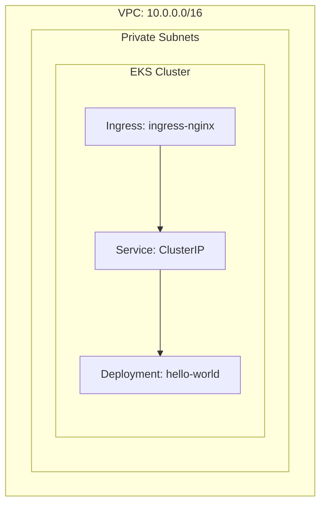

# Marriott Platform

AWS EKS deployment with Terraform, GitHub Actions, and OPA policies.

## Architecture



## CI/CD Pipeline

- **PR**: Auto-trigger `terraform validate`
- **Manual**: Select environment → `terraform plan` → `terraform apply`
- **Isolation**: Terraform workspace per environment (dev/test/perf/staging/prod)

## Directory Structure

```
marriott/
├── terraform/           # Infrastructure code
│   ├── main.tf          # EKS + Helm
│   ├── variables.tf     # Variables
│   ├── outputs.tf       # Outputs
│   ├── versions.tf      # Provider versions
│   └── ingress.tf       # Kubernetes Ingress
├── environments/        # Environment configs
│   ├── dev/
│   ├── test/
│   ├── perf/
│   ├── staging/
│   └── prod/
├── policies/            # OPA policies
│   ├── approval.rego    # Staging/prod approval
│   ├── secret_scan.rego # Credential scanning
│   └── test/
├── hello-world/         # Helm chart
├── .github/workflows/
│   └── terraform.yml
└── README.md
```

## Environments

| Environment | Cluster | Namespace | Purpose |
|-------------|---------|-----------|---------|
| dev | marriott-dev | dev | Development |
| test | marriott-test | test | QA Testing |
| perf | marriott-perf | perf | Performance |
| staging | marriott-staging | staging | UAT |
| prod | marriott-prod | prod | Production |

## Prerequisites

| Tool | Version |
|------|---------|
| Terraform | >= 1.15 |
| AWS Provider | ~> 6.54 |
| Kubernetes Provider | ~> 3.2 |
| Helm Provider | ~> 3.2 |
| EKS Cluster | 1.31 |
| hello-world (nginx) | 1.16.0 |

## GitHub Actions Setup

**Secrets:**
| Name | Description |
|------|-------------|
| `AWS_ACCESS_KEY_ID` | AWS access key |
| `AWS_SECRET_ACCESS_KEY` | AWS secret key |

**Variables:**
| Name | Default |
|------|---------|
| `AWS_DEFAULT_REGION` | `us-east-1` |

## Terraform State Backend

The following resources must be created in advance:
- **S3 Bucket**: `marriott-terraform-state` — stores state files
- **DynamoDB Table**: `terraform-locks` — state lock to prevent concurrent conflicts

## Security Policies

- **Approval**: Staging/prod require MR approval; dev/test/perf manual only
- **Secret Scanning**: Blocks deployments with hardcoded credentials
